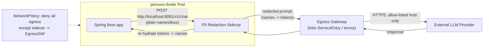

# AI Firewall — Securing Egress to the External LLM

## Problem

`persons-finder` sends person data (names, bios) to an external LLM provider
over the internet. That's a direct PII egress path: anything the app sends
in the prompt leaves our security boundary and lands in a third party's
logs, training pipelines (depending on provider terms), and support tooling.
We want the app's business logic to keep working without every engineer who
touches it having to remember to redact names by hand.

## Design: PII Redaction Sidecar + Egress Gateway

Two complementary layers, not one:

1. **A redaction sidecar**, in the same pod as the app, catches PII *before*
   it leaves the pod's network namespace.
2. **An egress gateway**, at the cluster boundary, guarantees that traffic to
   the LLM provider can *only* go through that sidecar — so a bug, a new
   code path, or a misconfigured pod can't bypass redaction entirely.

### 1. The sidecar

- Runs as a second container in the same pod, reachable only on
  `localhost` (no ClusterIP, no DNS entry) — the app's HTTP client points
  at `http://localhost:8081` instead of the provider's URL directly.
- Applies NER (named-entity recognition) + a regex/allow-list layer to catch
  names, emails, phone numbers, addresses in the outbound prompt, replacing
  each with a stable, reversible token (`{{PERSON_1}}`, `{{PERSON_2}}`).
- Keeps a short-lived, in-memory (or Redis, if it needs to survive a pod
  restart) mapping of token → original value, scoped to that single request,
  so it can substitute the real name back into the LLM's response before
  returning it to the app. The mapping never leaves the sidecar.
- Holds the actual `OPENAI_API_KEY` — the main app container doesn't need it
  at all once the sidecar owns the outbound call, which shrinks the blast
  radius if the app container is ever compromised.

### 2. The egress gateway

- A `NetworkPolicy` on the app's namespace denies all egress by default and
  allows the sidecar's port outbound only to the cluster's egress
  gateway/proxy — the app container itself has **no route to the internet**.
- The egress gateway (Istio `ServiceEntry` + `Sidecar` egress config, or a
  plain Envoy/NGINX forward proxy) allow-lists only the LLM provider's
  domain(s) on 443, with mTLS between the sidecar and the gateway.
- All egress is logged at the gateway (host, timestamp, request size — not
  payload contents) for audit, separate from application logs.

### Why two layers

The sidecar can be wrong (a new PII pattern it doesn't recognize yet). The
`NetworkPolicy` + egress gateway can't be bypassed by an app-level bug,
because there is no network path to the LLM provider that skips the
gateway. Redaction failing open still fails inside an audited, allow-listed
channel — it doesn't also leak somewhere unmonitored.

### What's already in this repo vs. what's designed-not-built

- `k8s/deployment.yaml` provisions `OPENAI_API_KEY` as a Secret-backed env
  var directly on the app container. That matches the *current* codebase,
  which doesn't yet make an outbound LLM call.
- If/when that call is implemented, the recommended change is: move the
  secret to the sidecar container only, add the sidecar + `NetworkPolicy`
  above, and point the app's HTTP client at the sidecar's `localhost` port.
  That's a config change to the Deployment (add a container + a
  NetworkPolicy resource), not a rearchitecture of the app.

## Trade-offs / open questions

- **Latency**: an extra hop adds a few ms per call; acceptable for a
  chat/summary use case, worth measuring for anything latency-sensitive.
- **Redaction accuracy**: NER models miss edge cases (nicknames, unusual
  name formats). Treat this as risk reduction, not a compliance guarantee —
  pair it with a data processing agreement with the LLM provider, not
  instead of one.
- **Token re-hydration state**: keeping it in-memory in the sidecar is
  simplest and avoids a shared store, but means retries after a sidecar
  restart lose the mapping mid-request — acceptable for synchronous
  request/response, would need Redis for anything async/streaming.
