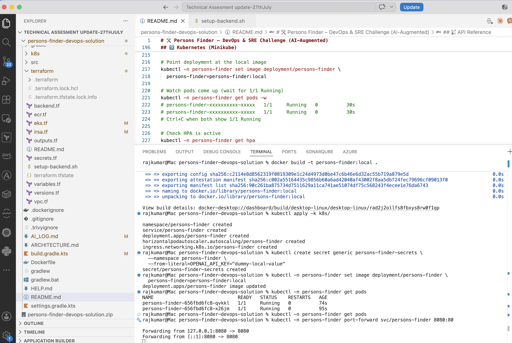
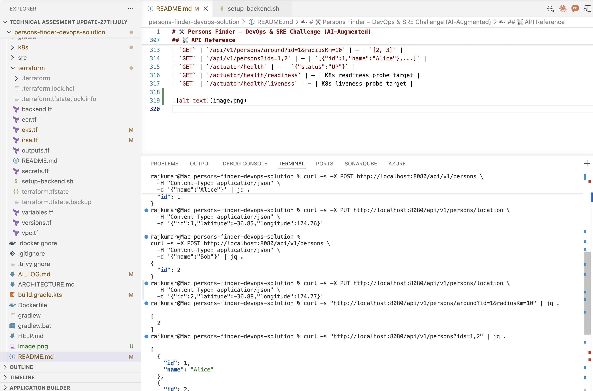
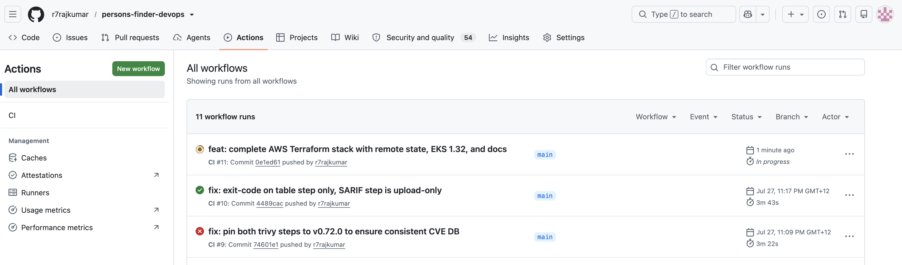

# 🛠️ Persons Finder – DevOps & SRE Challenge (AI-Augmented)

Welcome to the **Persons Finder** DevOps challenge.

**Scenario:**
The development team has finished the `persons-finder` API (a Java/Kotlin Spring Boot app that talks to an external LLM). It works on their machine. Now, **you** need to take it to production.

**Our Philosophy:** We want engineers who use AI to move fast, but who have the wisdom to verify every line.

---

## 🎯 The Mission

Your task is to Containerize, Infrastructure-as-Code (IaC), and secure this application.

### 1. 🐳 Containerization
*   Create a `Dockerfile` for the application.
*   **AI Challenge:** Ask an AI (ChatGPT/Claude) to write the Dockerfile.
*   **Audit:** The AI likely missed best practices (e.g., non-root user, multi-stage build, pinning versions). **Fix them.**
*   *Output:* An optimized `Dockerfile`.

### 2. ☁️ Infrastructure as Code (Kubernetes/Terraform)
*   Deploy this app to a local cluster (Minikube/Kind) or output Terraform for AWS/GCP.
*   **Requirements:**
    *   **Secrets:** The app needs an `OPENAI_API_KEY`. Do not bake it into the image. Show how you inject it securely (K8s Secrets, Vault, etc.).
    *   **Scaling:** Configure HPA (Horizontal Pod Autoscaler) based on CPU or custom metrics.
*   **AI Task:** Use AI to generate the K8s manifests (Deployment, Service, Ingress). **Document what you had to fix.** (Did it forget `readinessProbe`? Did it request 400 CPUs?)

### 3. 🛡️ The "AI Firewall" (Architecture)
The app sends user PII (names, bios) to an external LLM provider.
*   **Design Challenge:** Create a short architectural diagram or description (`ARCHITECTURE.md`) showing how you would secure this egress traffic.
*   **Question:** How would you implement a "PII Redaction Sidecar" or Gateway logic to prevent real names from leaving our cluster? You don't have to build it, just design the infrastructure for it.

### 4. 🤖 CI/CD & AI Usage
*   Create a CI pipeline (GitHub Actions preferred).
*   **The AI Twist:** We want to fail the build if the code "looks unsafe".
    *   Add a step in the pipeline that runs a security scanner (Trivy/Snyk) OR a mocked "AI Code Reviewer" step.

---

## 📝 Mandatory: The AI Log (`AI_LOG.md`)

We hire engineers who know how to collaborate with machines.
Please verify your work by documenting:

1.  **The Prompt:** "I asked ChatGPT: *'Write a K8s deployment for a Spring Boot app'*."
2.  **The Flaw:** "It gave me a deployment running as `root` and with no resource limits."
3.  **The Fix:** "I modified lines 12-15 to add `securityContext`."

**If you do not include this log, we will not review your submission.**

---

## ✅ Getting Started

1.  Clone this repo.
2.  Assume the code inside is a buildable Spring Boot app (or build it with `./gradlew build`).
3.  Push your solution (Dockerfile, K8s manifests/Terraform, CI configs) to your own public repository.

## 📬 Submission

Submit your repository link. We care about:
*   **Security:** How you handle the API Key.
*   **Reliability:** Probes, Limits, Scaling.
*   **AI Maturity:** Your `AI_LOG.md` (Did you blindly trust the bot, or did you engineer it?).

---

## ✅ Solution Overview (this submission)

| Requirement | Where |
|---|---|
| Business logic (the repo's own `TODO`s) | `src/main/kotlin/.../domain/services`, `.../presentation/PersonController.kt` |
| Dockerfile (multi-stage, non-root, pinned, healthcheck) | [`Dockerfile`](Dockerfile), [`.dockerignore`](.dockerignore) |
| Kubernetes manifests (Deployment/Service/Ingress/Secret/HPA) | [`k8s/`](k8s) |
| Terraform (AWS, bonus path) | [`terraform/`](terraform) |
| AI Firewall design | [`ARCHITECTURE.md`](ARCHITECTURE.md) |
| CI/CD (build, test, mocked AI reviewer, Trivy gate) | [`.github/workflows/ci.yml`](.github/workflows/ci.yml) |
| AI Log | [`AI_LOG.md`](AI_LOG.md) |

---

## 🚀 Local Setup — Prerequisites

| Tool | Version | Notes |
|---|---|---|
| **Java (JDK)** | 11+ | Any distribution works (OpenJDK, Temurin, Corretto, Zulu, Oracle). Project targets Java 11 bytecode — tested with Temurin 21. |
| **Gradle** | 8.10.2 | Via wrapper (bundled) — see step 1 below to regenerate `gradle-wrapper.jar` |
| **Docker** | Any recent | [Docker Desktop](https://www.docker.com/products/docker-desktop) (Mac/Windows) or Docker Engine (Linux) |
| **kubectl** | Any recent | Mac: `brew install kubectl` · Windows: [install guide](https://kubernetes.io/docs/tasks/tools/install-kubectl-windows/) · Linux: package manager |
| **minikube** | v1.38+ | Mac: `brew install minikube` · Windows/Linux: [install guide](https://minikube.sigs.k8s.io/docs/start/) |

**Platform notes:**
- **Mac/Linux**: Commands shown use bash/zsh syntax
- **Windows**: Use PowerShell or WSL2 for the best experience. For `curl` commands, either install [curl for Windows](https://curl.se/windows/) or use `Invoke-WebRequest` equivalents

---

## 1️⃣ Run Locally (Gradle)

The `gradle-wrapper.jar` must exist before `./gradlew` works. Generate it once after cloning:

**Mac/Linux:**
```bash
# Download Gradle 8.10.2 and regenerate the wrapper jar
curl -L https://services.gradle.org/distributions/gradle-8.10.2-bin.zip -o /tmp/gradle-8.10.2-bin.zip
unzip /tmp/gradle-8.10.2-bin.zip -d /tmp/
/tmp/gradle-8.10.2/bin/gradle wrapper --gradle-version 8.10.2

# Verify wrapper jar exists
ls gradle/wrapper/
# gradle-wrapper.jar  gradle-wrapper.properties
```

**Windows (PowerShell):**
```powershell
# Download Gradle 8.10.2
Invoke-WebRequest -Uri https://services.gradle.org/distributions/gradle-8.10.2-bin.zip -OutFile $env:TEMP\gradle-8.10.2-bin.zip
Expand-Archive -Path $env:TEMP\gradle-8.10.2-bin.zip -DestinationPath $env:TEMP
& "$env:TEMP\gradle-8.10.2\bin\gradle.bat" wrapper --gradle-version 8.10.2

# Verify wrapper jar exists
dir gradle\wrapper\
```

Build and run tests:

```bash
./gradlew clean build --no-daemon
# Windows: .\gradlew.bat clean build --no-daemon
# BUILD SUCCESSFUL — 7 tests pass
```

Run the app:

```bash
./gradlew bootRun --no-daemon
# Windows: .\gradlew.bat bootRun --no-daemon
# App starts on http://localhost:8080
```

Smoke test:

```bash
curl http://localhost:8080/actuator/health
# {"status":"UP","groups":["liveness","readiness"]}

curl -s -X POST http://localhost:8080/api/v1/persons \
  -H "Content-Type: application/json" \
  -d '{"name":"Alice"}' | jq .
# {"id": 1}

curl -s -X PUT http://localhost:8080/api/v1/persons/location \
  -H "Content-Type: application/json" \
  -d '{"id":1,"latitude":-36.85,"longitude":174.76}'

curl -s -X POST http://localhost:8080/api/v1/persons \
  -H "Content-Type: application/json" \
  -d '{"name":"Bob"}' | jq .
# {"id": 2}

curl -s -X PUT http://localhost:8080/api/v1/persons/location \
  -H "Content-Type: application/json" \
  -d '{"id":2,"latitude":-36.88,"longitude":174.77}'

# Who is within 10km of Alice?
curl -s "http://localhost:8080/api/v1/persons/around?id=1&radiusKm=10" | jq .
# [2]

# Get names by ids
curl -s "http://localhost:8080/api/v1/persons?ids=1,2" | jq .
# [{"id":1,"name":"Alice"},{"id":2,"name":"Bob"}]
```

---

## 2️⃣ Docker

```bash
# Build the image (multi-stage, non-root)
docker build -t persons-finder:local .

# Run the container
docker run -p 8080:8080 -e OPENAI_API_KEY=dummy-local persons-finder:local

# Verify it runs as non-root (in another terminal)
docker inspect persons-finder:local | grep User
# "User": "spring"  ← UID 10001, never root

# Test
curl http://localhost:8080/actuator/health
```

---

## 3️⃣ Kubernetes (Minikube)

```bash
# Start minikube
minikube start
minikube addons enable metrics-server   # required by hpa.yaml

# Point Docker CLI at minikube's daemon and build image inside it
eval $(minikube docker-env)
docker build -t persons-finder:local .

# Deploy all resources (namespace, deployment, service, hpa)
kubectl apply -k k8s/
# Note: Ingress will error on the placeholder domain — that's expected for local testing

# Create the secret imperatively (never committed with a real value)
kubectl create secret generic persons-finder-secrets \
  --namespace persons-finder \
  --from-literal=OPENAI_API_KEY="dummy-local-value"

# Point deployment at the local image
kubectl -n persons-finder set image deployment/persons-finder \
  persons-finder=persons-finder:local

# Watch pods come up (wait for 1/1 Running)
kubectl -n persons-finder get pods -w
# persons-finder-xxxxxxxxxx-xxxxx   1/1     Running   0          30s
# persons-finder-xxxxxxxxxx-xxxxx   1/1     Running   0          30s
# Ctrl+C when both show 1/1 Running

# Check HPA is active
kubectl -n persons-finder get hpa
# MINPODS: 2, MAXPODS: 8, REPLICAS: 2

# Forward port and test
kubectl -n persons-finder port-forward svc/persons-finder 8080:80
# In another terminal:
curl http://localhost:8080/actuator/health
# {"status":"UP","groups":["liveness","readiness"]}
```

---

## 4️⃣ Mocked AI Code Reviewer

```bash
chmod +x .github/scripts/ai-code-review.sh
.github/scripts/ai-code-review.sh
```

Expected output (all green):

```
== Checking for hardcoded secrets ==
✅ No hardcoded secret literals found.
== Checking Dockerfile for a non-root USER ==
✅ Dockerfile switches to a non-root user.
== Checking Kubernetes Deployment for resource limits ==
✅ Resource limits are set.
== Checking Kubernetes Deployment for probes ==
✅ readiness/liveness probes are present.
== Checking for leftover TODO() stubs in main sources ==
✅ No TODO() stubs left in src/main.

All heuristic checks passed.
```

---

## 5️⃣ CI/CD (GitHub Actions)

The pipeline runs automatically on push/PR to `main`. Three jobs:

| Job | What it does |
|---|---|
| `build-and-test` | `./gradlew build` — compiles + runs all unit tests |
| `ai-code-review` | runs `.github/scripts/ai-code-review.sh` — fails build if unsafe |
| `docker-build-and-scan` | builds image, runs Trivy (fails on CRITICAL/HIGH), pushes to GHCR on `main` only |

To validate the workflow YAML locally:

```bash
cat .github/workflows/ci.yml | python3 -c "import sys,yaml; yaml.safe_load(sys.stdin); print('YAML valid')"
```

---

## 6️⃣ AWS Deployment (Terraform + EKS) — Optional

Full production deployment to AWS with Terraform:

- **VPC** with public + private subnets
- **EKS cluster** (v1.32, 2× t3.medium nodes)
- **ECR** repository
- **Secrets Manager** for OPENAI_API_KEY
- **IRSA** for pod-level IAM permissions
- **S3 + DynamoDB** for remote state + locking

**Cost: ~$133/month if left running**

```bash
cd terraform

# Step 1: Bootstrap the remote state backend (one-time only)
chmod +x setup-backend.sh
./setup-backend.sh $(aws sts get-caller-identity --query Account --output text) ap-southeast-2

# Step 2: Initialise Terraform with remote state backend
# (no account ID hardcoded in any file)
ACCOUNT_ID=$(aws sts get-caller-identity --query Account --output text)
terraform init \
  -backend-config="bucket=persons-finder-terraform-state-${ACCOUNT_ID}" \
  -backend-config="key=persons-finder/terraform.tfstate" \
  -backend-config="region=ap-southeast-2" \
  -backend-config="encrypt=true" \
  -backend-config="dynamodb_table=persons-finder-terraform-lock"

# Step 3: Plan and apply
terraform plan
terraform apply

# Step 4: Configure kubectl
aws eks update-kubeconfig --region ap-southeast-2 --name persons-finder-cluster
kubectl get nodes

# Step 5: Deploy the app
kubectl apply -k ../k8s/
kubectl create secret generic persons-finder-secrets \
  --namespace persons-finder \
  --from-literal=OPENAI_API_KEY="$OPENAI_API_KEY"

# Step 6: Set the secret value (never stored in Terraform state)
aws secretsmanager put-secret-value \
  --secret-id persons-finder/openai-api-key \
  --secret-string "$OPENAI_API_KEY"

# Destroy when done (avoid ongoing charges)
terraform destroy
```

See [`terraform/README.md`](terraform/README.md) for full instructions.

---

## 📡 API Reference

| Method | Path | Body / Query | Response |
|---|---|---|---|
| `POST` | `/api/v1/persons` | `{"name": "Alice"}` | `{"id": 1}` |
| `PUT` | `/api/v1/persons/location` | `{"id":1,"latitude":-36.85,"longitude":174.76}` | `200 OK` |
| `GET` | `/api/v1/persons/around?id=1&radiusKm=10` | — | `[2, 3]` |
| `GET` | `/api/v1/persons?ids=1,2` | — | `[{"id":1,"name":"Alice"},...]` |
| `GET` | `/actuator/health` | — | `{"status":"UP"}` |
| `GET` | `/actuator/health/readiness` | — | K8s readiness probe target |
| `GET` | `/actuator/health/liveness` | — | K8s liveness probe target |







